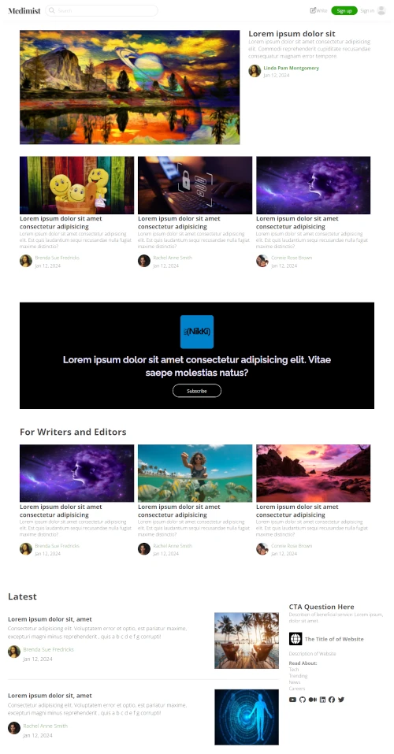

<a id="readme-top"></a>

# Medimist
> Simple HTML template ready to convert to WordPress Theme.

This template was inspired by the simplicity of the website design on Medium.com. Don't let the simplicity fool you because it took quite a bit of tweaking to make this a block-style template so that it can easily be converted into a Full Site Editor WordPress theme. Although it holds a high resemblance to the Medium website design, it is intentionally not an exact replica of Medium website due to personal preferences and the discovery that Medium has inconsistencies and some layouts on their site does not make optimal use of the screen space.




# Table of Contents
<!-- TABLE OF CONTENTS -->
<details>
  <summary>Table of Contents</summary>
  <ol>
    <li><a href="#release-history">Release History</a></li>
    <li><a href="#installation">Installation</a></li>
    <li><a href="#meta">Meta</a></li>
    <li><a href="#license">License</a></li>
    <li><a href="#contributing">Contributing</a></li>
  </ol>
</details>

<p align="right">(<a href="#readme-top">back to top</a>)</p>


## Release History

* 0.0.1
    * Work in progress - The first release only contains the home page in html format and supporting files.

### Installation

1. Clone the repo
   ```sh
   git clone https://github.com/nicoleweathers/medimist.git
   ```
<p align="right">(<a href="#readme-top">back to top</a>)</p>

## Meta

Nikki (WebDGem) – [@WebDGem](https://www.youtube.com/@webdgem) – YouTube channel

[https://github.com/nicoleweathers/medimist](https://github.com/nicoleweathers/)

## License

Distributed under the MIT License. See `LICENSE.txt` for more information.

<p align="right">(<a href="#readme-top">back to top</a>)</p>

## Contributing

Contributions are what make the open source community such an amazing place to learn, inspire, and create. Any contributions you make are **greatly appreciated**.

If you have a suggestion that would make this better, please fork the repo and create a pull request. You can also simply open an issue with the tag "suggestion".
Don't forget to give the project a star! Thanks again!

1. Fork the Project
2. Create your Feature Branch (`git checkout -b fork/YourContribution`)
3. Commit your Changes (`git commit -m 'Add some YourContribution'`)
4. Push to the Branch (`git push origin fork/YourContribution`)
5. Open a Pull Request

<p align="right">(<a href="#readme-top">back to top</a>)</p>
